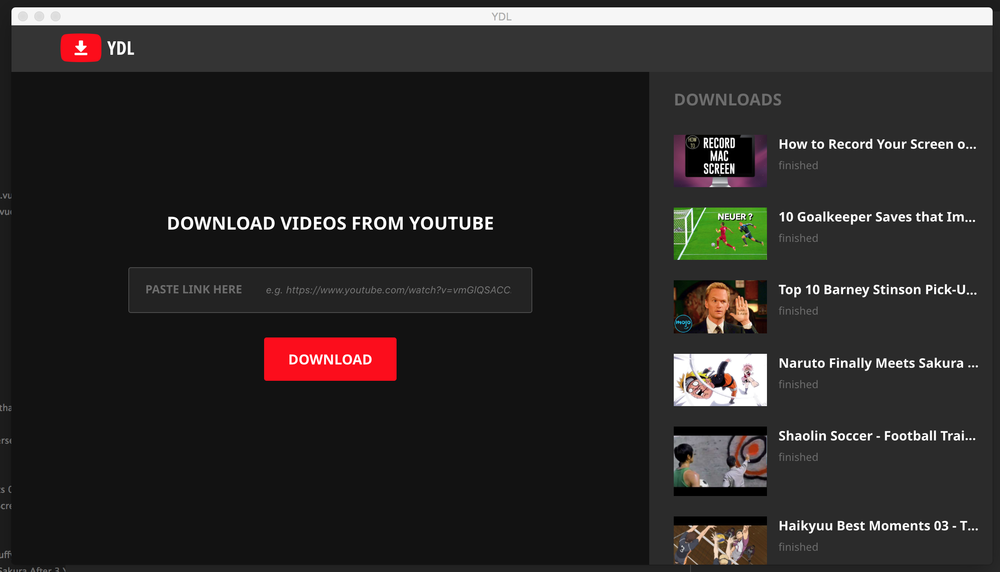

# Youtube dl desktop app

## How to run
* install the requirements using pip 
```
$ pip install -r requirements.txt
```
* build vue
```
$ cd web
$ npm install
$ npm run build
```
* run the main file
```
$ cd ..
$ python main.py
```

